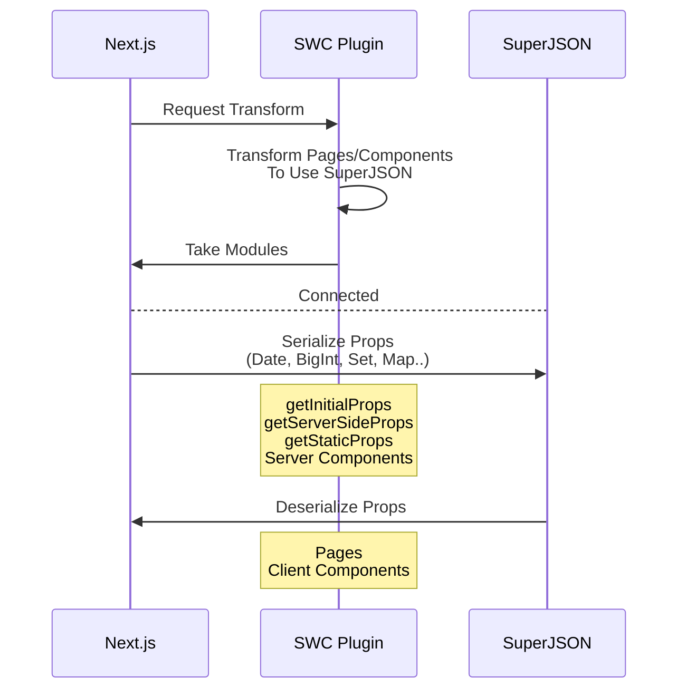

<h1 align="middle"> Next SuperJSON Plugin</h1>
<h3 align="middle">🔌 SuperJSON Plugin for Next.js (SWC)</h3>

### /pages (Pages Directory)

```jsx
export default function Page({ date }) {
  return <div>Today is {date.toDateString()}</div>;
}

// You can also use getInitialProps, getStaticProps
export const getServerSideProps = () => {
  return {
    props: {
      date: new Date(),
    },
  };
};
```

- Allows pre-rendering functions to return props including [Non-JSON Values](https://github.com/blitz-js/superjson#parse)(Date, Map, Set..)

### /app (App Directory)

```jsx
// Use "data-superjson" attribute to pass non-serializable props to client components
// No needs to change the propsType of Client Component (It's type-safe!)

export default function ServerComponent() {
  const date = new Date();
  return <ClientComponent date={date} data-superjson />;
}
```

- Provides `data-superjson` attribute for [Server Component > Client Component Serialization](https://nextjs.org/docs/app/building-your-application/rendering/composition-patterns#passing-props-from-server-to-client-components-serialization).

## Usage

Install packages first:

```sh
npm install superjson next-superjson-plugin
# or Yarn
yarn add superjson next-superjson-plugin
```

Add the plugin into `next.config.js`

```js
// next.config.js
module.exports = {
  experimental: {
    swcPlugins: [["next-superjson-plugin", {}]],
  },
};
```

### Options

You can use the `excluded` option to exclude specific properties from serialization.

```js
['next-superjson-plugin', { excluded: ["someProp"] }],
```

## How it works



## Notes on this Fork

This fork is based on the original plugin by [orionmiz](https://github.com/orionmiz)

It is updated to support Next.js 14.2, where there was previous SWC version incompatibilities with NextJS upstream.

Solves this category of issue occurring at build time for static /pages:

```
Error: failed to process failed to invoke plugin: failed to invoke plugin on (...)

Caused by:
    0: failed to invoke `/node_modules/next-superjson-plugin/dist/next_superjson.wasm` as js transform plugin at /node_modules/next-superjson-plugin/dist/next_superjson.wasm
    1: failed to run Wasm plugin transform. Please ensure the version of `swc_core` used by the plugin is compatible with the host runtime. See https://swc.rs/docs/plugin/selecting-swc-corefor compatibility information. If you are an author of the plugin, please update `swc_core` to the compatible version.
    2: RuntimeError: out of bounds memory acces
```

## Bug Report

⚠️ Keep in mind: SWC Plugin is still an experimental feature for Next.js

Plugin always ensures compatibility with [Next.js Canary version](https://nextjs.org/docs/messages/opening-an-issue) only.

[Leave an Issue](https://github.com/with-power/next-superjson-plugin/issues)

## Special Thanks

- [kdy1](https://github.com/kdy1) (Main creator of swc project)
- [orionmiz](https://github.com/orionmiz) (Original author of the plugin)

## Development

1. Build via Rust `cargo` the WASM SWC plugin

```sh
rustup target add wasm32-wasi
cargo build --target wasm32-wasi --release
```

This should dump a `next_superjson.wasm` file into the `target/wasm32-wasi/release` directory.

2. Compile the plugin

```sh
pnpm install
pnpm prepack
```

This builds artifacts into the `dist` directory.
